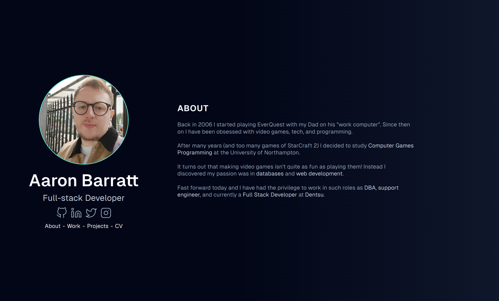
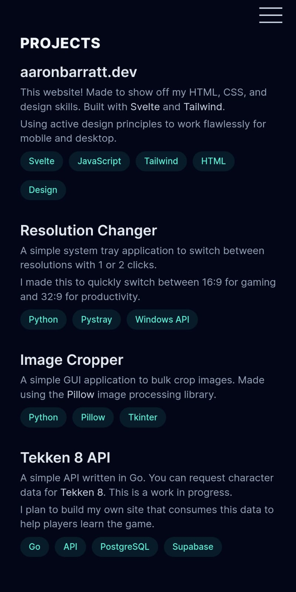

# www.aaronbarratt.dev

This is a simple static website to show myself off and highlight some of my personal projects and work history. Created using Svelte and Tailwind CSS.

## Desktop Layout

## Mobile Layout

## Setup and Install

1. Clone the repo `git clone https://github.com/BanAaron/aaronbarratt-v2.git`.
2. Navigate to the root directory `cd aaronbarratt-v2/`.
3. Install with npm `npm install`.
4. Run dev version `npm run dev`.
5. Open http://localhost:5173/ in your browser of choice.
